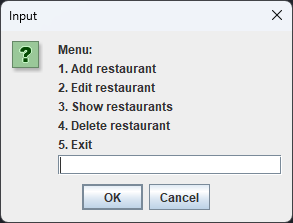
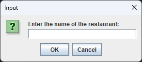
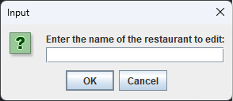
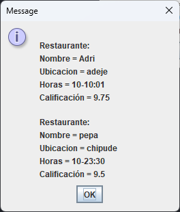
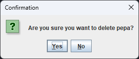
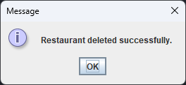

# Manual de usuario

En el momento de arrancar el programa aparecerá la siguiente ventana con un menú solicitando una elección.

### Añadir restaurante 

En caso de seleccionar la opcion 1 nos llevará a esta ventana en la que nos solicitaran el nombre, acto seguido pedirá el resto de datos del restaurante.

### Editar restaurante 

En caso de elegir la opcion 2 se nos preguntará el nombre del restaurante que desamos editar y nos saltarán unas ventanas iguales a las de la creaccion.

### Mostrar restaurantes 

En caso de elegir la opcion 3 se nos mostrará mediante una ventana emergente un listado de los restaurantes ordenados por orden alfabético 

### Eliminar restaurantes 

En caso de elegir la opcion 4 se nos mostrará mediante una ventana emergente un cuadro de dialogo que nos pedirá el nombre de un restaurante para eliminarlo

Al colocar un numbre y darle a "OK" nos saldrá una ventana preguntando si estamos seguros

En caso de haber dicho que si nos mostrará mediante un mensaje que se ha borrado satisfactoriamente.

